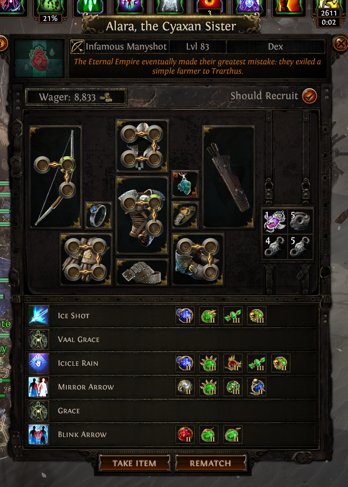

# PoEMercPricer

In-game overlay for Path of Exile **3.29.3** Mercenary Warrants.

Press **Ctrl+Shift+M** (configurable) while the mercenary inspect panel is open, or after copying a Warrant with **Ctrl+C**. The overlay scores every 3.29 mercenary family: market-audited screens for Kineticist, Manyshot, Combatant, Sniper, Thunderquiver, and the Stormhand Arc sleeper, plus market-floor screens for every other family mined from live trade-ledger data, then shows a jackpot / skip verdict.

Inspired by [Awakened PoE Trade](https://github.com/SnosMe/awakened-poe-trade): hotkey → read the game → a dark gold card on top of the client. This tool never injects into the process or edits memory. It only reads the clipboard and (optionally) a screenshot, the same class of input APT uses.



## Features

- Always-on-top overlay (egui), Scan / Clipboard / Settings like a companion widget
- Global hotkey (default `Ctrl+Shift+M`)
- Clipboard input accepts Warrant text, copied image pixels, or a PNG/JPEG/WebP
  copied as a file in Explorer
- Native, on-demand screen OCR of the inspect panel on Windows (`Windows.Media.Ocr`)
- Current 3.29.3 OCR catalog: **all 36 builds and 267 active-skill names**
- OCR of active-skill names plus image recognition for all **151 currently attainable support names**, with every visible support tier **I / II / III**
- Active-skill level derivation: level-83 mercenary → skill level 26; level-84 → 27
- Market-audited screens for **Kineticist**, **Manyshot**, **Combatant**, **Sniper**, **Thunderquiver**, plus the **Stormhand Arc** sleeper
- Every other family gets a **market-floor screen** mined from the Perandus Ledger listing snapshot (money skill + skill-bound support gates + bricks), capped below the premium bands except for depth-backed jackpot packages (e.g. Swiftblade Rallying Cry + CDR + More Duration)
- Jackpot boolean screens (premium packages with no bricks)
- Score breakdown, copy summary, and a pre-filled official Path of Exile trade search
- Settings: projectile-speed Return, clipboard-first, always-on-top, PoE window title

Scores are **screening heuristics**, not Divine/Mirror quotes. GGG confirms a Warrant **keeps skills** and **rerolls gear** — value the skills and their attached supports.

## Install

### From source (Windows)

```powershell
git clone https://github.com/Lisood/PoEMercPricer
cd PoEMercPricer
cargo run --release
```

A `target/release/poemercpricer.exe` is produced. Put a shortcut wherever you like.

PoE should be **Windowed Fullscreen**. If the game is running as Administrator, run PoEMercPricer as Administrator too so the hotkey registers.

### Try the UI without the game

```powershell
cargo run --release -- --fixture
```

## Usage

| Action | What it does |
|--------|----------------|
| `Ctrl+Shift+M` | Scan: clipboard Warrant if present, otherwise screenshot + OCR |
| **Scan** | Force a screen capture of the Path of Exile window |
| **Clipboard** | Scan Warrant text or a copied screenshot/image file |
| **Copy summary** | Skill list + score onto the clipboard |
| **Search official trade** | Opens one pre-filled Path of Exile trade search for the exact warrant type, level, and most-supported skill |
| **Settings** | Hotkey, Frost Blades Return, always-on-top, debug dumps |

CLI (optional):

```powershell
poemercpricer.exe --fixture
poemercpricer.exe --scan samples\manyshot_alara.png
poemercpricer.exe clipboard < warrant.txt
poemercpricer.exe score --family kineticist --skill "Kinetic Blast of Clustering:returnT3,gmpT3,chainT2,edwaT3" --skill "Greater Kinetic Blast"
```

Config is stored at `%APPDATA%\PoEMercPricer\PoEMercPricer\config.json`.

Trade searches are built locally from the bundled official 3.29 stat-ID snapshot. PoE's
anonymous search accepts only one exact mercenary stat group, so the app searches the
scanned warrant type and level plus its most-supported skill and that skill's linked
supports. This preserves support-to-skill binding; a looser all-skill query would produce
false matches. The status line names the selected skill and discloses the reduction. The
app performs no trade API polling, background requests, result fetching, or automatic
retries: clicking **Search official trade** causes one normal browser navigation, with a
two-second double-click guard. Change **Trade league** in Settings when needed.

## Scoring

Support tier factor used by the 0–100 screen:

| In-game | Tier | Factor |
|---------|------|--------|
| absent | 0 | 0.0 |
| Lesser / I | 1 | 0.6 |
| normal / II | 2 | 0.8 |
| Greater or Gilded / III | 3 | 1.0 |

Worked Kineticist example: KBoC + Return III + GMP III + Chain II + Greater EDWA + Greater Kinetic Blast → **84** (jackpot screen).

Full formulas and the mechanical audit (EDWA more-multipliers, CDR, Return geometry) live in [`docs/formulas.md`](docs/formulas.md).

**Fast in-game rules**

- Kineticist: stop for KBoC + Return. The proven premium gate is Greater Kinetic Blast + Return + GMP on KBoC; Barrage is the budget pair. Reject Kinetic Bolt or Kinetic Rain stealing attacks.
- Manyshot: Vaal Ice Shot + Mirror Arrow, with Return bound to Vaal Ice Shot; no Icicle Rain. The biggest gate also has Return + GMP on fixed Ice Shot.
- Combatant: exactly one of Frost Blades / Wild Strike plus Static Strike. The Frost Blades value cliff is Return + Greater EDWA + Chain; Return DPS still depends on roughly 150% projectile speed or favourable walls.
- Stormhand sleeper: Arc + Ball Lightning of Static, with Chain + Gilded Chain Distance bound to Arc. Market evidence is strong; combat-efficacy reports are mixed.

Every current build and skill is recognised and scored. Families outside the audited set use **market-floor screens** derived from a 2026-09-01 Perandus Ledger snapshot (see `docs/research-3.29.md`): each screens for its money skill and the skill-bound support package the market actually pays for, and dump-tier variants score skip. Only unmatched families fall back to a conservative **EST.**-badged estimate.

## How it reads the game

1. **Clipboard (preferred).** Hover a Mercenary Warrant and press `Ctrl+C`, or copy a screenshot. The **Clipboard** button accepts exact Warrant text, copied bitmap pixels, and PNG/JPEG/WebP files copied in Explorer (including `samples\\manyshot_alara.png`).
2. **Screenshot OCR + icon recognition.** For images, the overlay reads current active-skill names from the panel text, matches market-relevant support artwork, and reads each support's Roman tier. Support matches stay bound to their owning skill row. **Scan** captures the Path of Exile window directly.

Some Mercenary supports deliberately reuse byte-identical art. Skill and visible-tier compatibility resolve 97.08% of the audited 3.29 contexts. If several valid supports are still physically indistinguishable, the UI shows only the catalog-backed choices as buttons. Select the support shown in game and the score and copied summary update immediately. Alternatively, hover that support in Path of Exile and press **Scan** again: the existing OCR pass reads the visible tooltip title automatically. Clipboard Warrant text remains exact for those cases.

### Lightweight OCR contract

- OCR calls the native Windows API directly: no OCR subprocess, temporary image, bundled neural model, or resident background OCR service.
- Only the inspect panel's left two-thirds text/header column is passed to OCR. Support cells are handled by a small pixel matcher.
- The complete 3.29 support catalog is available to recognition: **152 support identities collapse to 65 unique pixel arts**, loaded lazily once at 32×32 and 16×16. Shared silver/gold art is filtered by active skill and visible tier; a visible tooltip disambiguates any surviving identical-art candidates without another OCR pass.
- Scanning runs on demand on a worker thread. The UI is event-driven: it does not
  continuously repaint or poll the hotkey while idle, and the worker requests one
  repaint when its result is ready.

The enforced budgets, benchmark method, and regression tests are documented in [`docs/performance.md`](docs/performance.md).
The desktop layout, accessibility rules, and reactive-rendering contract are documented in [`docs/ui-design.md`](docs/ui-design.md).

The art/catalog snapshot is generated from current [PoEDB Mercenary game data](https://poedb.tw/us/Mercenaries). PoEDB is credited as the retrieval and data-reference source; all Path of Exile names, game data, icons, images, artwork, and other game materials remain the property of Grinding Gear Games Limited or its licensors. The money gates were checked against the live Allflame warrant export; methodology, exact filters, observed floors, level rules, and limitations are recorded in [`docs/research-3.29.md`](docs/research-3.29.md).

### Grinding Gear Games credit

Path of Exile and all associated game content, names, images, skill and support icons, artwork, and intellectual property are owned by or licensed to **Grinding Gear Games Limited**. All rights are reserved by their respective owners.

This product isn't affiliated with or endorsed by Grinding Gear Games in any way. PoEMercPricer is an unofficial, non-commercial community project. See [Third-Party Notices](THIRD_PARTY_NOTICES.md) for the complete attribution and asset-licensing boundary.

## Safety / ToS

- No memory reading, no packet injection, no input spam
- One action per keypress
- Open source

That matches the public posture of Awakened PoE Trade. This product isn't affiliated with or endorsed by Grinding Gear Games in any way.

## Development

```powershell
cargo test
cargo run -- --fixture
```

Refresh the 3.29 catalog and icon templates:

```powershell
.\scripts\fetch-icons.ps1 -RefreshCatalog
```

Rust 1.80+. Windows is the supported overlay/OCR platform.

## License

PoEMercPricer's original source code and documentation are available under the [MIT License](LICENSE). That licence does **not** apply to Path of Exile names, game data, text, icons, images, artwork, screenshots, or other materials owned by or licensed to Grinding Gear Games Limited. No rights to those materials are granted by this repository. See [Third-Party Notices](THIRD_PARTY_NOTICES.md).
