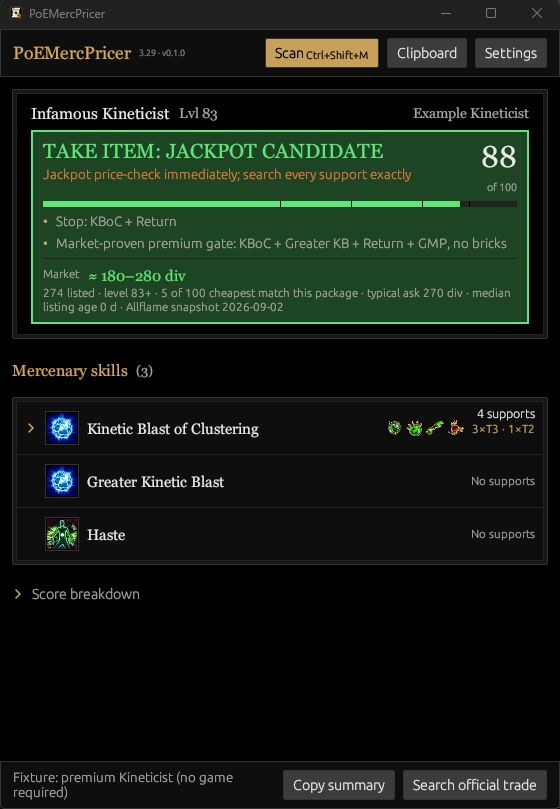
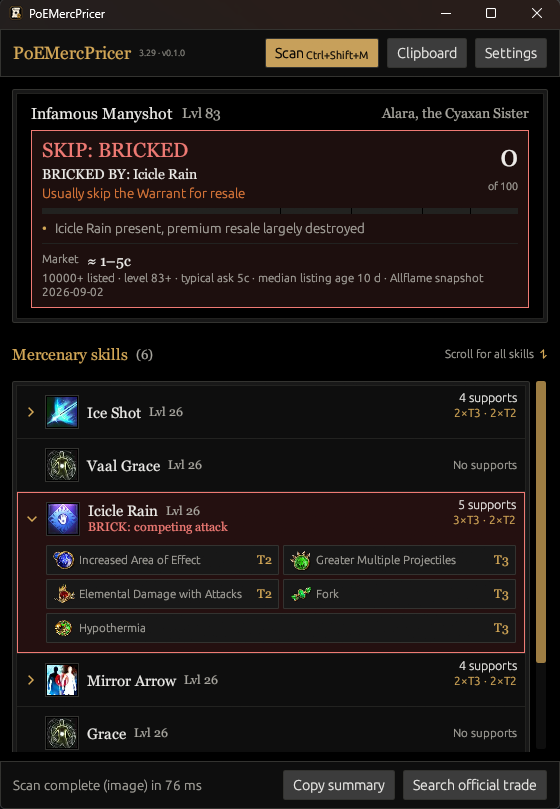

# PoEMercPricer

In-game overlay for Path of Exile 3.29.3 Mercenary Warrants.

Press Ctrl+Shift+M (configurable in Settings) while the mercenary inspect panel is open, or after copying a Warrant with Ctrl+C. The overlay scores every 3.29 mercenary family and prints a jackpot or skip verdict. Kineticist, Manyshot, Combatant and the Stormhand Arc sleeper get market-audited screens; every other family gets a market-floor screen mined from live trade-ledger data.

Inspired by [Awakened PoE Trade](https://github.com/SnosMe/awakened-poe-trade): hotkey, read the game, draw a dark gold card on top of the client. It never injects into the process or edits memory. It reads the clipboard and, if you ask it to, a screenshot.



## Features

- Always-on-top overlay (egui) with Scan, Clipboard and Settings buttons
- Global hotkey, default `Ctrl+Shift+M`
- Clipboard input takes Warrant text, copied image pixels, or a PNG/JPEG/WebP
  copied as a file in Explorer
- On-demand screen OCR of the inspect panel on Windows, via `Windows.Media.Ocr`
- The 3.29.3 OCR catalog covers all 36 builds and 267 active-skill names
- OCR reads active-skill names; image recognition handles all 151 currently attainable support names, at every visible tier I / II / III
- Active-skill level comes from mercenary level: 83 gives skill level 26, 84 gives 27
- Market-audited screens for Kineticist, Manyshot, Combatant, and the Stormhand Arc sleeper. Sniper and Thunderquiver are scored as floor families: their packages sit at 1c on the ledger (Tornado Shot with GMP, n=8,383; Lightning Arrow with Return and GMP, n=3,404)
- A market ask range next to the score, from a bundled snapshot of the cheapest level-83+ instant-buyout listings on the official trade site per family and support package, with listing count, listing age, and the snapshot date (see `docs/market-3.29.md`; refresh with `scripts/fetch-warrant-prices.ps1`)
- Every other family gets a market-floor screen mined from the Perandus Ledger listing snapshot (money skill, skill-bound support gates, bricks), capped below the premium bands except for depth-backed jackpot packages like Swiftblade Rallying Cry + CDR + More Duration
- Jackpot boolean screens for premium packages with no bricks
- Score breakdown, copy summary, and a pre-filled official Path of Exile trade search
- Settings for the theme, the scan hotkey, clipboard-first scanning, projectile-speed Frost Blades Return, always-on-top, hide on Escape, the trade league, updates, and (under Advanced) debug capture dumps and the PoE window title
- Checks GitHub Releases for a newer version at startup and every 6 hours, installs it after verifying the checksum, and tells you it runs on the next start or when you press Restart. Off with `--no-updates` or in Settings.

The scores are screening heuristics, not Divine/Mirror quotes. GGG confirms a Warrant keeps skills and rerolls gear, so what you are valuing is the skills and the supports attached to them.

## Requirements

- Windows 10 or 11, 64-bit. There is no Linux or macOS build.
- A GPU and driver that expose Vulkan, or OpenGL as a fallback. The overlay renders through wgpu and picks Vulkan when an adapter exists, otherwise GL. Set `WGPU_BACKEND=gl` to force the fallback if the window fails to open.
- An English Windows OCR language pack, for screen scans only. Install it under Settings > Time & Language > Language & region > Add a language > English (United States), with Optical character recognition ticked. Clipboard Warrant text needs no OCR at all. The engine refuses to run on a non-English pack rather than produce garbage, so a Windows in another display language still needs English added.
- Path of Exile in Windowed Fullscreen or Windowed. Exclusive Fullscreen blocks both the overlay and the screen capture.
- If Path of Exile runs as Administrator, run PoEMercPricer as Administrator too. Otherwise Windows refuses the global hotkey while the game has focus.

The download is one unsigned exe of about 8.8 MB. There is no installer and no runtime to add.

## Install

### Download (Windows)

Get `poemercpricer-windows-x64.exe` from the [Releases page](https://github.com/Lisood/PoEMercPricer/releases). Rename it to `poemercpricer.exe` if you like, and put it in a folder you can write to (not Program Files) so updates can replace it. A folder such as `C:\Games\PoEMercPricer\` or somewhere under your user profile works.

The first run shows a SmartScreen prompt because the exe is unsigned: click More info, then Run anyway. An update the app installs itself carries no Mark-of-the-Web, so it shows no prompt.

Each release also carries `poemercpricer-windows-x64.exe.gz`, a gzip of the same bytes that the updater prefers, and `THIRD_PARTY_NOTICES.html`, the per-crate licence text for that exact build. Neither is needed to run the app.

### From source (Windows)

```powershell
git clone https://github.com/Lisood/PoEMercPricer
cd PoEMercPricer
cargo build --release
```

That produces `target/release/poemercpricer.exe`. Put a shortcut wherever you like. Rust 1.88 or newer.

Release builds open no console window. Start the exe from a terminal when you want to see what the commands below print, or what a panicking worker or a failed background update check wrote to stderr.

### Try the UI without the game

```powershell
cargo run --release -- --fixture
```

## First scan

1. Start PoEMercPricer. The window opens on top of everything, with a status line that names the hotkey.
2. In Path of Exile, open the mercenary inspect panel so the skill rows and their support cells are visible.
3. Press `Ctrl+Shift+M`.

The hotkey does two things in order. It reads the clipboard first and, if the clipboard holds Warrant text, parses that; otherwise it captures the Path of Exile window and runs OCR plus icon recognition on it. Turn off "Read copied Warrant text before screen capture" in Settings if you want the hotkey to always capture the screen.

The overlay then shows the mercenary class and family, the skill rows with their support gems and tiers, a 0-100 score with its band, the reasons behind the score, any bricks, and a market ask range when the bundled snapshot has one for that package. The buttons at the bottom copy a text summary or open a pre-filled trade search.

## Usage

| Action | What it does |
|--------|----------------|
| `Ctrl+Shift+M` | Scan: clipboard Warrant if present, otherwise screenshot + OCR |
| Scan | Force a screen capture of the Path of Exile window, ignoring the clipboard |
| Clipboard | Scan Warrant text or a copied screenshot/image file |
| Copy summary | Skill list + score onto the clipboard |
| Search official trade | Opens one pre-filled Path of Exile trade search for the exact warrant type, level, and the money skill with its supports. Turn on "Search every skill" in Settings to also require up to four more of the warrant's skills; that needs a pathofexile.com login in your browser because anonymous searches allow only one skill group |
| Update to X | Appears once a check finds a newer release and "Install updates automatically" is off. Downloads and verifies it |
| Restart to update | Appears once a downloaded update is verified and in place. Restarts into the new version; nothing restarts on its own |
| Settings | Full-window pane, described below. Edits apply at once and save when you go back |
| Escape | Hides the window, unless you turn that off in Settings. Press the hotkey to bring it back |

### Clipboard Warrant

Hover a Mercenary Warrant in game and press `Ctrl+C`, then press the hotkey or click Clipboard. This path is exact: it parses the item text PoE puts on the clipboard, so support names and tiers come out exactly as the game has them, without OCR. It works while the game runs in Windowed mode too.

### Screenshot or image file

Click Scan to capture the Path of Exile window, or copy an image and click Clipboard. Clipboard accepts both copied bitmap pixels (from an editor or a browser) and a PNG, JPEG or WebP file copied in Explorer, including `samples\manyshot_alara.png`. Images are capped at 8192 px per side, and clipboard bitmaps at 40 million pixels total.

For images, the overlay reads current active-skill names from the panel text and matches support artwork cell by cell, reading each support's Roman tier. Support matches stay bound to their owning skill row.



### Ambiguous supports

Some Mercenary supports deliberately reuse byte-identical art. Skill and visible-tier compatibility resolve 97.08% of the audited 3.29 contexts. When several valid supports are still physically indistinguishable, that cell is drawn in orange with the catalog-backed choices as buttons. Click the one shown in game and the score, the reasons and the copied summary update immediately.

Two other ways out: hover that support in Path of Exile and scan again, because the existing OCR pass reads the visible tooltip title on its own, or copy the Warrant with `Ctrl+C`, whose text is exact.

### Trade search

Trade searches are built locally from the bundled official 3.29 stat-ID snapshot. PoE's anonymous search accepts only one exact mercenary stat group, so the app searches the scanned warrant type and level plus its most-supported skill and that skill's linked supports. That keeps support-to-skill binding intact; a looser all-skill query returns false matches. The status line names the skill it picked and says that it narrowed the query.

There is no trade API polling, background requests, result fetching, or automatic retries. Clicking Search official trade causes one normal browser navigation, with a two-second double-click guard. Change the trade league in Settings when you need to.

## Settings

Open the pane with the Settings button. Changes take effect as you make them and are written to disk when you press Done or Back. A hotkey you typed by hand has to parse before the pane will close.

| Setting | Default | What it does |
|---|---|---|
| Theme | Standard | Standard, Dark, Light, or Follow Windows. Follow Windows reads the Windows app mode and falls back to Standard when Windows does not report one |
| Scan hotkey | `Ctrl+Shift+M` | The global hotkey. Type it, or press Record and press the combination; Escape cancels the recording. Ctrl, Shift, Alt or Win plus a letter or digit. Record cannot capture the Win key, so a Win combination has to be typed. A new hotkey applies after you restart the app |
| Read copied Warrant text before screen capture | on | Whether the hotkey checks the clipboard before capturing the screen. The Scan button always captures; the Clipboard button always reads the clipboard |
| Assume 150%+ projectile speed for Frost Blades | off | Scores Combatant Frost Blades Return as if the mercenary has the projectile speed it needs to land its return hits |
| Always on top | on | Keeps the overlay above the game window |
| Hide the window when Escape is pressed | on | Escape hides the overlay instead of leaving it up. The hotkey brings it back. Turned off automatically when the hotkey could not be registered, so the window cannot become unreachable |
| League | Allflame | The league the trade search targets. The dropdown lists the bundled snapshot's league, its Hardcore variant, Standard and Hardcore; pick Custom to type any other name. No network access is involved |
| Search every skill | off | Adds up to four more of the warrant's skills to the trade query, five groups in total. Anonymous searches reject more than one group, so this needs a pathofexile.com login in your browser |
| Check for updates at startup and every 6 hours | on | The automatic update check. Release builds only; a `cargo run` checkout never self-updates |
| Install updates automatically | on | Downloads and verifies a newer release as soon as a check finds one. Off, a check only notifies and you get an Update to X button. Either way you choose when to restart |
| Save the last capture for diagnostics (Advanced) | off | Writes the last captured image to `debug\last-capture.png` inside the config folder. Useful for a bug report; crop it before you attach it |
| Path of Exile window title (Advanced) | `Path of Exile` | The window title the Scan button looks for. An exact match wins over a title that merely starts with it, so a browser tab named "Path of Exile ..." does not get captured instead of the game |

The Updates section also shows two lines of state, a Check now button (or Update to X, or Restart to update, or Open releases page after a failure), and a Release notes link that opens the Releases page. Check now works even when the automatic check is off or `--no-updates` was passed.

## Config file

```
%APPDATA%\PoEMercPricer\PoEMercPricer\config\config.json
```

The Open config folder link at the top right of the Settings pane opens it in Explorer. Everything in the pane maps to one key:

```json
{
  "hotkey": "Ctrl+Shift+M",
  "assume_projectile_speed": false,
  "dump_debug": false,
  "poe_window_title": "Path of Exile",
  "scan_clipboard_first": true,
  "always_on_top": true,
  "hide_on_escape": true,
  "trade_league": "Allflame",
  "trade_every_skill": false,
  "check_updates": true,
  "install_updates_automatically": true,
  "theme": "standard"
}
```

`theme` is one of `"standard"`, `"dark"`, `"light"` or `"system"`; an unknown value falls back to Standard.

To reset everything, close the app, delete `config.json`, and start it again: a missing file is rewritten with the defaults above. A file that fails to parse is left untouched and reported in the status line, and defaults are used until you fix it, so a typo never costs you the rest of the file.

Debug captures, when you turn that Advanced option on, land in a `debug` subfolder next to `config.json`. Nothing else is written anywhere: no registry keys, no services, no start-menu entries, no files beside the game.

## Updates

At startup, and every 6 hours while the overlay stays open, release builds make one HTTPS request to `api.github.com` for the latest release. If a newer version is out, it downloads `poemercpricer-windows-x64.exe` from github.com, checks its size and SHA-256 against the digest GitHub publishes, and replaces `poemercpricer.exe` in place. When the release also carries the `.gz` sibling, that smaller file is fetched instead and inflated locally, then checked against the same size and digest as the exe, so it is trusted no further. A download that fails either check is discarded and nothing on disk changes.

Nothing installs on exit and nothing restarts on its own. Once the new exe is in place, the status line says so and a Restart to update button appears in the command bar. You can ignore it: the new version runs the next time you start PoEMercPricer anyway.

### Rolling back

The exe that was running is kept next to the new one as `poemercpricer-previous.exe`. If the new version fails to start, close the app, delete `poemercpricer.exe`, rename `poemercpricer-previous.exe` back to `poemercpricer.exe`, and open an issue with both version numbers. Turn the update check off before you start it again, or it will install the same broken release. Delete the previous exe once you are happy with the new one; the next update writes a fresh copy.

### Turning it off

Clear "Check for updates at startup and every 6 hours" in Settings, or start the app with `--no-updates`. Either way no request is made unless you press Check now yourself. Debug builds never check.

## Uninstall

There is no installer, so there is nothing to uninstall. Delete these and the machine is clean:

- `poemercpricer.exe` and, if it exists, `poemercpricer-previous.exe`
- the folder `%APPDATA%\PoEMercPricer`, which holds `config\config.json` and any debug captures

## Command line

Three flags change how the overlay starts. Each one opens the window.

```powershell
poemercpricer.exe --fixture     # open with a canned Kineticist jackpot
poemercpricer.exe --no-updates  # start without checking GitHub
poemercpricer.exe --scan samples\manyshot_alara.png   # open and scan that image
```

A bare path with no flag means the same as `--scan`. `--fixture` and `--no-updates` combine.

The rest print to the terminal they were started from and exit without opening a window. In PowerShell, pipe the output to keep it (`poemercpricer.exe dump-scan x.png | Out-String > out.txt`); a plain `>` does not capture from a windowless exe.

```powershell
poemercpricer.exe --help
poemercpricer.exe --version
poemercpricer.exe clipboard < warrant.txt
poemercpricer.exe score --family kineticist --skill "Kinetic Blast of Clustering:returnT3,gmpT3,chainT2,edwaT3" --skill "Greater Kinetic Blast"
poemercpricer.exe dump-scan samples\manyshot_alara.png
poemercpricer.exe dump-trade-query samples\manyshot_alara.png Allflame --every-skill
poemercpricer.exe dump-clipboard-scan          # optional: add a path to save the image
poemercpricer.exe dump-window-scan out.png
```

`dump-clipboard-scan` and `dump-window-scan` are the two diagnostics worth attaching to a bug report: the first scans whatever image is on the clipboard, the second captures the live Path of Exile window. Give either an optional path and it saves the image it worked from. `dump-window-scan` reads `config.json` but never creates or rewrites it.

## Scoring

Support tier factor used by the 0-100 screen:

| In-game | Tier | Factor |
|---------|------|--------|
| absent | 0 | 0.0 |
| Lesser / I | 1 | 0.6 |
| normal / II | 2 | 0.8 |
| Greater or Gilded / III | 3 | 1.0 |

Worked Kineticist example: KBoC + Return III + GMP III + Chain II + Greater EDWA + Greater Kinetic Blast scores 84, which is a jackpot screen.

Full formulas and the mechanical audit (EDWA more-multipliers, CDR, Return geometry) live in [`docs/formulas.md`](docs/formulas.md).

Fast in-game rules:

- Kineticist: stop for KBoC + Return. The proven premium gate is Greater Kinetic Blast + Return + GMP on KBoC; Barrage is the budget pair. Reject Kinetic Bolt or Kinetic Rain stealing attacks.
- Manyshot: Vaal Ice Shot + Mirror Arrow, with Return bound to Vaal Ice Shot, and no Icicle Rain. The biggest gate also has Return + GMP on fixed Ice Shot.
- Combatant: exactly one of Frost Blades / Wild Strike plus Static Strike. The Frost Blades value cliff is Return + Greater EDWA + Chain. Return DPS still depends on roughly 150% projectile speed or favourable walls.
- Stormhand sleeper: Arc + Ball Lightning of Static, with Chain + Gilded Chain Distance bound to Arc. Market evidence is strong; combat-efficacy reports are mixed.

Every current build and skill is recognised and scored. Families outside the audited set use market-floor screens derived from a 2026-09-01 Perandus Ledger snapshot (see `docs/research-3.29.md`): each one screens for its money skill and the skill-bound support package the market actually pays for, and dump-tier variants score skip. Only unmatched families fall back to a conservative estimate, badged `EST.` in the UI.

## How it reads the game

1. Clipboard (preferred). Exact Warrant text, copied bitmap pixels, or a PNG/JPEG/WebP file copied in Explorer.
2. Screenshot OCR + icon recognition. The overlay reads active-skill names from the panel text, matches support artwork, and reads each support's Roman tier, keeping every match bound to its skill row.

### OCR footprint

- OCR calls the native Windows API directly. There is no OCR subprocess, temporary image, bundled neural model, or resident background OCR service.
- Only the inspect panel's left three-quarters text/header column is passed to OCR. Support cells go through a small pixel matcher.
- Recognition has the complete 3.29 support catalog available: 152 support identities collapse to 65 unique pixel arts, loaded lazily once at 32x32 and 16x16. Shared silver/gold art is filtered by active skill and visible tier, and a visible tooltip disambiguates any surviving identical-art candidates without another OCR pass.
- Scanning runs on demand on a worker thread. The UI is event-driven: it does not
  continuously repaint or poll the hotkey while idle, and the worker asks for one
  repaint when its result is ready.
- A scan that has not reported back after 30 seconds is abandoned. The buttons come back and the next scan starts clean; a late result from the abandoned worker is discarded rather than shown.

Limits, benchmark method, and the regression tests are in [`docs/performance.md`](docs/performance.md).
Layout, accessibility rules, and how the UI avoids repainting are in [`docs/ui-design.md`](docs/ui-design.md).

The art/catalog snapshot is generated from current [PoEDB Mercenary game data](https://poedb.tw/us/Mercenaries). PoEDB is credited as the retrieval and data-reference source. All Path of Exile names, game data, icons, images, artwork, and other game materials remain the property of Grinding Gear Games Limited or its licensors. The money gates were checked against the live Allflame warrant export; methodology, exact filters, observed floors, level rules, and limitations are recorded in [`docs/research-3.29.md`](docs/research-3.29.md).

## Troubleshooting

The status line under the command bar carries the reason for every failure, and starting the exe from a terminal shows what a crashed worker printed. These are the failures with a fix.

### The hotkey does nothing

Another app already owns that combination; Windows hands a global hotkey to exactly one registrant, and the status line says so at startup. Pick a different one in Settings and restart the app. When registration fails, hide-on-Escape is turned off for that run, so the window cannot vanish with no way back.

If the hotkey works on the desktop but not while the game has focus, Path of Exile is running elevated and this app is not. Start PoEMercPricer as Administrator too.

### The window disappeared

Escape hides it. Press the hotkey to bring it back, or clear "Hide the window when Escape is pressed" in Settings.

### "no text recognized; is the Warrant panel open?"

OCR read nothing usable. The inspect panel has to be open and unobstructed at the moment of capture, and the capture has to be the game rather than a menu or a loading screen. Copying the Warrant with `Ctrl+C` and clicking Clipboard avoids OCR entirely.

### "captured frame is black; set Path of Exile to Windowed Fullscreen"

Windows returns a black bitmap for an exclusive-fullscreen DirectX client. Switch the game to Windowed Fullscreen or Windowed. The app falls back to grabbing the whole monitor only when the window rect covers that monitor exactly, which is what a borderless fullscreen game reports; a genuinely windowed game is not captured that way, because the desktop behind it is not the panel.

### "Path of Exile window not found"

No window title starts with what the app is looking for. Set the real title under Settings > Advanced > Path of Exile window title. A minimized game reports itself separately: restore it and scan again.

### "no Windows OCR language is installed", or English is missing

Add English (United States) under Settings > Time & Language > Language & region > Add a language, with Optical character recognition ticked, then scan again. A non-English pack is refused on purpose, because it produces confident nonsense rather than an error.

### An update failed and antivirus is the suspect

The swap writes a fresh unsigned exe next to the old one, which some scanners quarantine. The failure surfaces in the status line, and `poemercpricer-previous.exe` is there if a partial swap did land. Download the exe from the Releases page by hand, or add the folder to your scanner's exclusions.

### "permission denied writing ..."

The exe sits somewhere it cannot rewrite itself, usually Program Files. Move `poemercpricer.exe` to a folder you own.

### "GitHub rate limit, try again in an hour"

Unauthenticated GitHub API calls are capped at 60 per hour per IP. The app spends one per check, so something else on your network is using them. It retries on the next check.

### Two copies running

The second one fails to register the hotkey, because the first already holds it, and both draw on top of the game. Close the extra copy. If both happen to be mid-update, each writes its own temp file keyed to its process id, so neither corrupts the other's download.

### High-DPI displays

The overlay declares itself per-monitor DPI aware and captures in physical pixels, so display scaling does not distort a scan. The exception is `dump-window-scan` from the command line, which can run before that declaration takes effect; when the window rect and the monitor rect disagree, it refuses the monitor fallback rather than crop at the wrong scale. Use the Scan button in the app for anything that command reports oddly.

## Known limitations

- Windows only. The overlay, the capture path and the OCR engine are all Win32 or WinRT.
- Screen OCR reads English only. The game client is English regardless of profile language, so this is a Windows language-pack requirement rather than a game setting.
- Exclusive Fullscreen is not supported, by Windows rather than by choice.
- 2.92% of audited 3.29 support contexts stay ambiguous after skill and tier filtering, because the art is byte-identical. Those cells ask you to pick.
- Prices come from a snapshot bundled at build time, not a live query. They age between releases, and the UI shows the snapshot date so you can judge that.
- Scores are screening heuristics tuned to the ledger, not valuations. A thin book swings hard.
- The exe is unsigned, so the first download trips SmartScreen and some scanners look twice at the self-update.
- The catalog covers the 36 builds listed for 3.29.3. A new patch needs a new release before its skills are recognised.

## Safety and ToS

The app reads game memory nowhere, injects no packets, and sends no input to the client. Every scan is one action you asked for with one keypress, and the source is here to check. It is a separate executable, which GGG's [developer policy](https://www.pathofexile.com/developer/docs) permits without endorsing; that policy can change, so read the current one.

## Privacy and network

The app makes no network request except the update check: one HTTPS `GET` to `api.github.com` at startup and every 6 hours, and, only when there is something to install, a download from `github.com`. Those requests carry a `PoEMercPricer/<version>` user agent and a GitHub `Accept` header, and no body. No machine name, no account, no league, no scan result.

Nothing else leaves the machine. There is no telemetry, no crash reporting, no analytics, and no account of any kind. Scans, scores and clipboard text are held in memory and never written anywhere unless you turn on the Advanced debug capture, which writes one PNG into your own config folder. The trade search opens your browser at a URL built locally; the app itself never talks to the trade site. Turn the update check off and the app makes no outbound connection at all.

The refresh scripts under `scripts/` do fetch from PoEDB, the trade site, poe.ninja and the Perandus Ledger, but they are maintainer tools and the app never runs them.

## Reporting a bug

Open an issue with the [bug report template](.github/ISSUE_TEMPLATE/bug_report.md). Include your Windows version, the PoE version, the display mode, and the PoEMercPricer version from Settings > Updates or `poemercpricer --version`.

Crop screenshots to the mercenary panel. Leave out chat, the friends list, guild or account names, and anything else that identifies you: issues are public. The output of `dump-scan` or `dump-window-scan` is often more useful than a picture and carries none of that.

Security bugs go through GitHub's private vulnerability reporting instead. See [SECURITY.md](SECURITY.md).

## Development

```powershell
cargo fmt
cargo clippy --all-targets --locked -- -D warnings
cargo test --locked
```

Refresh the 3.29 catalog and icon templates:

```powershell
.\scripts\fetch-icons.ps1 -RefreshCatalog
```

Rust 1.88+. Windows is the only platform I support for the overlay and OCR. [CONTRIBUTING.md](CONTRIBUTING.md) has the rest, and `AGENTS.md` documents the release procedure.

## Grinding Gear Games credit

Path of Exile and all associated game content, names, images, skill and support icons, artwork, and intellectual property are owned by or licensed to Grinding Gear Games Limited. All rights are reserved by their respective owners.

This product isn't affiliated with or endorsed by Grinding Gear Games in any way. PoEMercPricer is an unofficial, non-commercial community project. See [Third-Party Notices](THIRD_PARTY_NOTICES.md) for the complete attribution and asset-licensing boundary.

## License

PoEMercPricer's original source code and documentation are available under the [MIT License](LICENSE). That licence does not apply to Path of Exile names, game data, text, icons, images, artwork, screenshots, or other materials owned by or licensed to Grinding Gear Games Limited. No rights to those materials are granted by this repository. See [Third-Party Notices](THIRD_PARTY_NOTICES.md).
